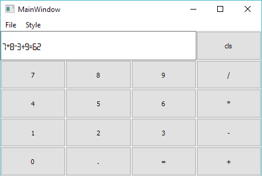
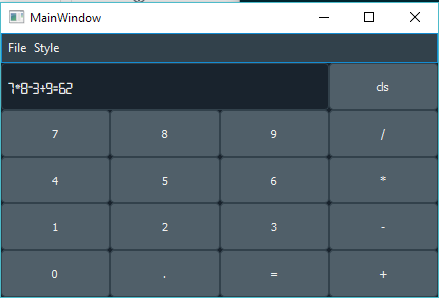
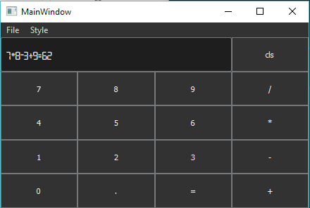

# pyqt5-calculator

This is a simple pyqt5 calculator demo

### How to run

1. git clone https://github.com/liudonghua123/pyqt5-calculator.git
2. pip install -r requirements.txt
3. install the font in `resources/Open 24 Display St.ttf` (optional)
4. run with`python calculator1.py` or `python calculator2.py`

### What is this

This is just for teaching purpose, `calculator1.py` is a plain widgets created by code, and `calculator2.py` is a rewrite work which using `designer` and themed with some stylesheet.

### Some snapshot

### Reference

- [https://build-system.fman.io/pyqt5-tutorial](https://build-system.fman.io/pyqt5-tutorial)
- [https://nikolak.com/pyqt-qt-designer-getting-started/](https://nikolak.com/pyqt-qt-designer-getting-started/)
- [https://github.com/ColinDuquesnoy/QDarkStyleSheet](https://github.com/ColinDuquesnoy/QDarkStyleSheet)
- [https://github.com/mstuttgart/qdarkgraystyle](https://github.com/mstuttgart/qdarkgraystyle)
- [https://stackoverflow.com/questions/8095062/pyqt-designer-and-layout-for-central-widget](https://stackoverflow.com/questions/8095062/pyqt-designer-and-layout-for-central-widget)
- [https://blog.csdn.net/yangyang031213/article/details/78584271](https://blog.csdn.net/yangyang031213/article/details/78584271)
- [https://stackoverflow.com/questions/7964869/qt-designer-how-to-add-custom-slot-and-code-to-a-button](https://stackoverflow.com/questions/7964869/qt-designer-how-to-add-custom-slot-and-code-to-a-button)
- [https://stackoverflow.com/questions/33462674/how-to-add-radio-button-in-menu-bar-qt-5-c](https://stackoverflow.com/questions/33462674/how-to-add-radio-button-in-menu-bar-qt-5-c)

### License

MIT
